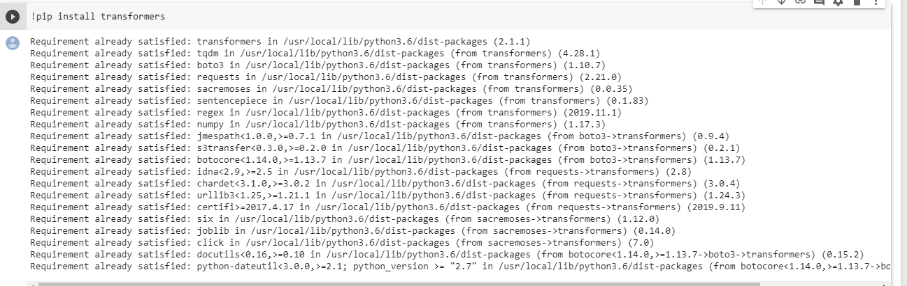
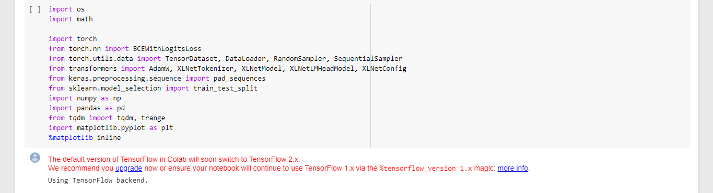
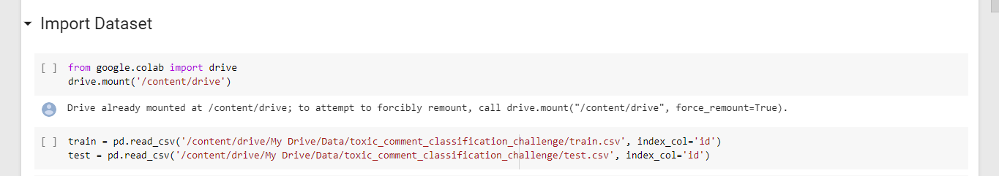
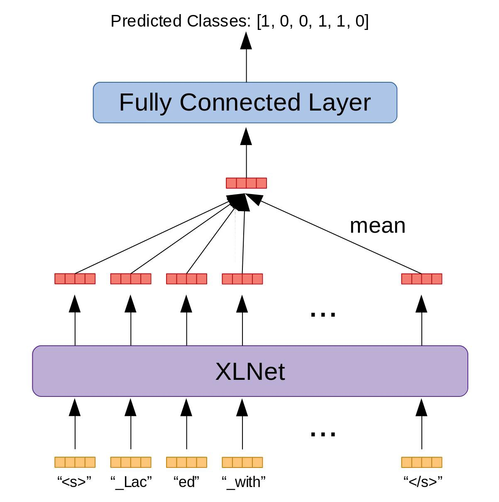
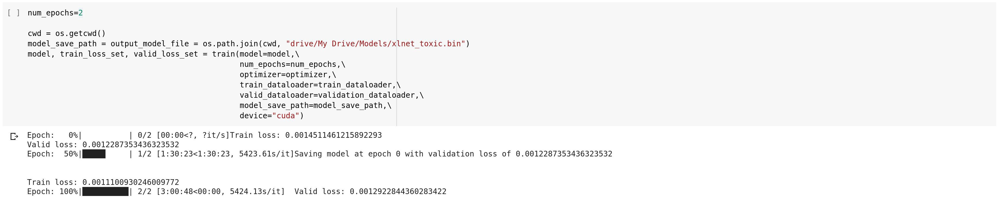

# Text-Classification
Used Transformers library (used for easy implementation of language models) and XLNET for multi-label classication. Used transfer learning for training the model. Trained model on Google Colab using Tesla P100 GPU. 

## Click here for the Colab notebook https://colab.research.google.com/drive/1YXojI6USFGV3498Pygllv0z8vTMVIiEt
## To start with code
1. Importing the Transformers library. The documentation can be found here https://pypi.org/project/transformers/

2. Next, we import neccessary libraries.

3. #### Pytorch comes by default in Google Colab. However, to install PyTorch for Jupyter, open Anaconda console and go on Environment. Type the library name in Search and install. Same with other libraries.

4. Before procedding with the code, the dataset train.csv and test.csv should be present inside your Google Drive. For this, make a folder in My Drive -> Data -> toxic_comment_classification_challenge. Inside this folder, put your train.csv and test.csv

5. We have 6 classes for classification in this dataset. However, the input sequence has 250 tokens. Hence, we perform mean-pooling of output vecots and produce a single vector with a dimension of 768. This vector will be the input to the fully connected layer that will predict the 6 common toxicity labels.

6. After this we defince the training function. A single epoch of training takes around 1 hour 30 minutes on a Tesla P100. Hence, instead of using a GPU, I recommend to use a CPU with not more than 10 epochs (to avoid crashing)

7. After our model is trained, we generate predictions for 153,164 test examples.

